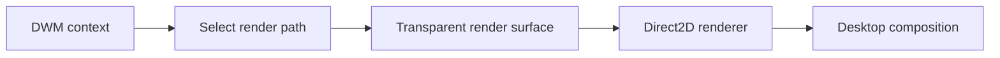

# DWM Overlay

This is a proof of concept I made while experimenting with rendering an overlay through `dwm.exe`.

The main goal was getting it working reliably on current versions of Windows 11 with NVIDIA graphics cards. A lot of older DWM overlay methods stopped behaving the same way after changes to Windows composition and presentation, so I wanted to see if I could make my own approach work on a modern setup.

It works, but I am keeping the source private. This repository is only here to show the project and explain the general idea behind it.

## What it does

- Runs from the DWM process context.
- Draws a transparent Direct2D overlay across the desktop.
- Supports text, shapes, selection areas, and basic interaction.
- Handles resolution and display changes without needing to restart.
- Uses a fallback rendering path for newer Windows/NVIDIA setups where older presentation methods are unreliable.

## How it works

At a high level, the project initializes its renderer from inside DWM and creates a surface that can be composed over the desktop. The drawing code is kept separate from the part that provides the surface, so the renderer can switch paths depending on what works on the system.

The current path uses a transparent, non-activating surface and Direct2D for rendering. I also experimented with DXGI presentation paths, but modern DWM behavior is not consistent enough to depend on a single presentation hook.

I am intentionally leaving out the implementation-specific parts such as loading, hooks, offsets, private interfaces, and version-specific internals.

More detail is available in [the architecture notes](docs/ARCHITECTURE.md).

## Demo

<!-- Replace this comment with a GIF or video when one is ready. -->

A short demo will be added showing the overlay running on Windows 11 with an NVIDIA GPU, including a display-size change and clean shutdown.

## Why no source?

The working project relies on undocumented Windows behavior and runs inside an important system process. I do not want to release code or binaries that people can blindly inject into DWM without understanding the risks.

This repository does **not** contain:

- source code;
- compiled DLLs or executables;
- an injector or loader;
- offsets, signatures, or hook locations;
- instructions for bypassing Windows security or capture behavior.

The purpose of the repository is to document the result, not provide a ready-to-use tool.

## Status

The PoC is working on my current Windows 11 and NVIDIA setup. I am still cleaning up the private project and testing display edge cases.
This file was automatically generated - I apologize if anything is not super clear feel free to message me on discord if you have questions @ carfs_s
