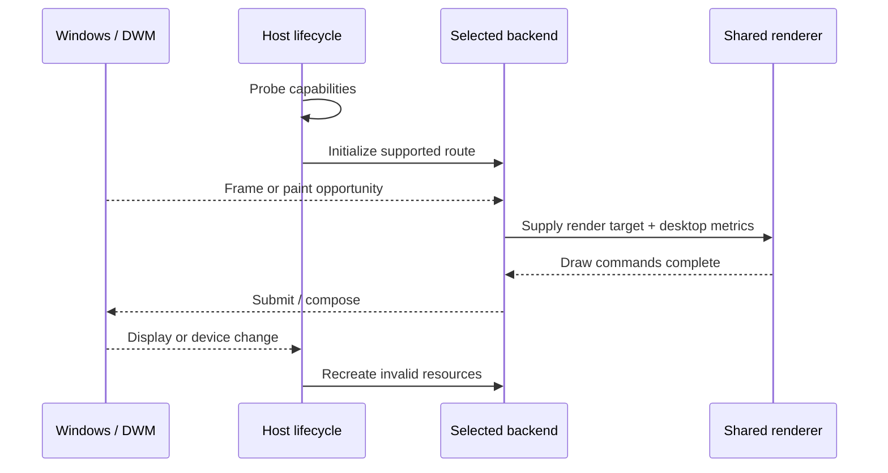

# Architecture Notes

This document explains the design vocabulary and engineering tradeoffs behind the showcase. It deliberately stays above implementation-level details that would make the private prototype directly reproducible.

## The desktop composition context

Desktop Window Manager (DWM) owns the final composition of visible Windows surfaces. Applications typically render into their own surfaces; DWM combines those surfaces with effects, transforms, color handling, and presentation policy to produce the desktop image.

A compositor-adjacent overlay therefore sits near several moving parts:

- **DWM**, which decides how desktop surfaces are composed.
- **DXGI**, which describes adapters, outputs, surfaces, and presentation.
- **Direct3D**, which owns GPU devices and textures.
- **Direct2D/DirectWrite**, which provide the 2D and text layer used by the prototype.
- **The display driver**, which can change which presentation optimizations are available.

None of those parts should be assumed to behave identically across Windows builds or GPU vendors.

## Two rendering backends, one renderer

The prototype separates *where a frame is submitted* from *what the frame contains*.

### Compatibility backend

The modern path uses a transparent, non-activating surface associated with the compositor context. It is sized to the virtual desktop, keeps interaction behavior explicit, and lets Windows perform normal composition. This path proved more predictable on the author's current Windows 11 / NVIDIA configuration.

### Experimental presentation backend

The research path observes compositor-owned DXGI presentation and can render through an eligible surface. It is valuable for learning, but private presentation behavior is not treated as a durable contract. Version-specific discovery and patching details are intentionally omitted.

### Shared graphics layer

The UI renderer accepts an abstract Direct2D target. It does not know which backend produced that target. Brushes, text formats, geometry, and layout logic are therefore shared, while device- and size-dependent resources remain backend-owned.

## State and interaction

Input is converted into a small state machine before rendering. The renderer reads a stable snapshot of that state and draws it; it does not perform slow work or own global input policy.

Typical states are conceptually similar to:

- idle;
- selecting;
- working;
- showing a result;
- hidden or shutting down.

The names are less important than the rule: frame-critical code should never wait for background work.

## Resource lifetime strategy

Graphics failures are easier to recover from when resources are grouped by what invalidates them:

| Resource class | Example | Recreate when |
|---|---|---|
| Process lifetime | Factories, immutable configuration | Host restarts |
| Device lifetime | Device-bound render targets | Device is removed or reset |
| Surface lifetime | Back buffer or compatible bitmap | Backend surface changes |
| Size lifetime | Clipping, virtual-desktop bitmap | Resolution/topology changes |
| Frame lifetime | Temporary geometry and state snapshot | Every frame |

The prototype also avoids holding stale compositor surfaces after a display transition.

## Why modern systems are different

Several optimizations can alter the route a desktop frame takes:

- flip-model presentation;
- independent flip eligibility;
- multiplane overlays;
- variable-refresh behavior;
- HDR/color-space negotiation;
- driver-specific composition decisions.

The lesson is architectural rather than vendor-specific: a private callback observed on one machine is evidence, not an API contract. Capability checks and a safe fallback are more durable than assuming one path will always fire.

## Failure containment

DWM is not an ordinary application process. A robust experiment should minimize the amount of work performed in its context, avoid blocking frame-critical execution, validate every graphics object before use, and make shutdown idempotent.

The private prototype follows these rules:

1. Drawing failures skip a frame rather than forcing continued use of an invalid surface.
2. Background work is isolated from the render path.
3. Cleanup first stops new work, then waits for in-flight work, then releases resources.
4. Optional research features can be disabled without disabling the compatibility renderer.
5. Debug logging is treated as development-only data and is never published with a demo.

## Deliberate omissions

This write-up does not include process-loading steps, memory modification recipes, private identifiers, hook indices, offsets, signatures, disassembly logic, capture-policy changes, or runnable pseudocode. Those details are not necessary to understand the architecture and would materially change the repository from a case study into an operational guide.

